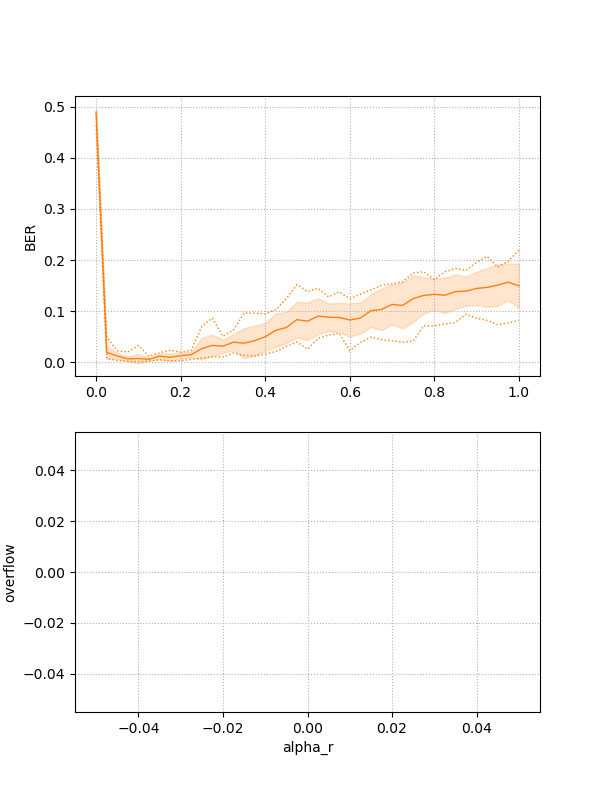
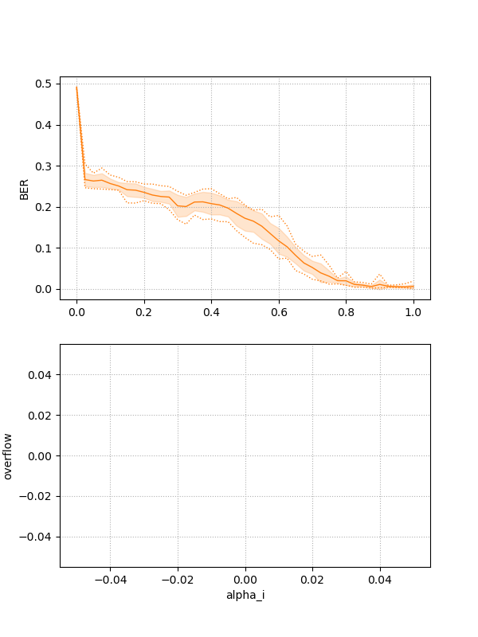
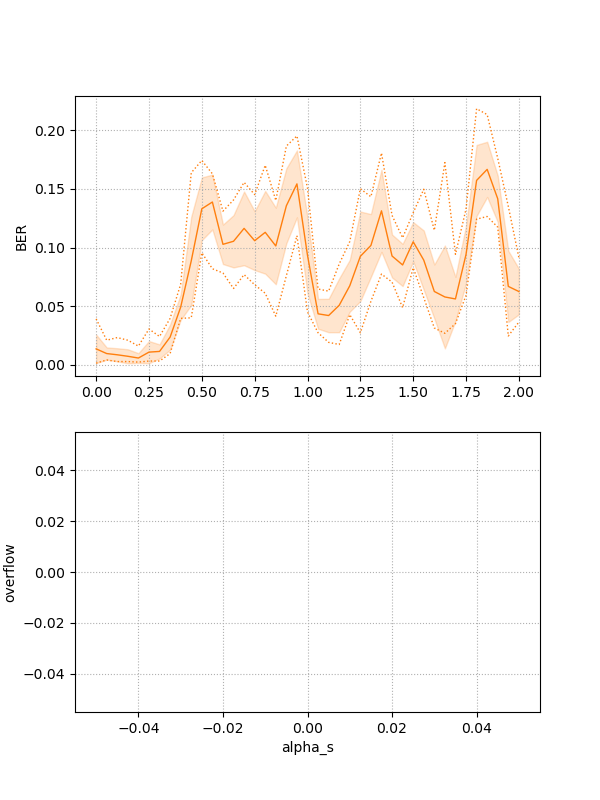
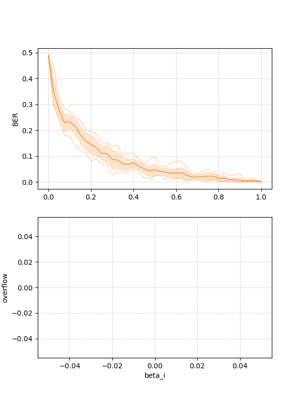
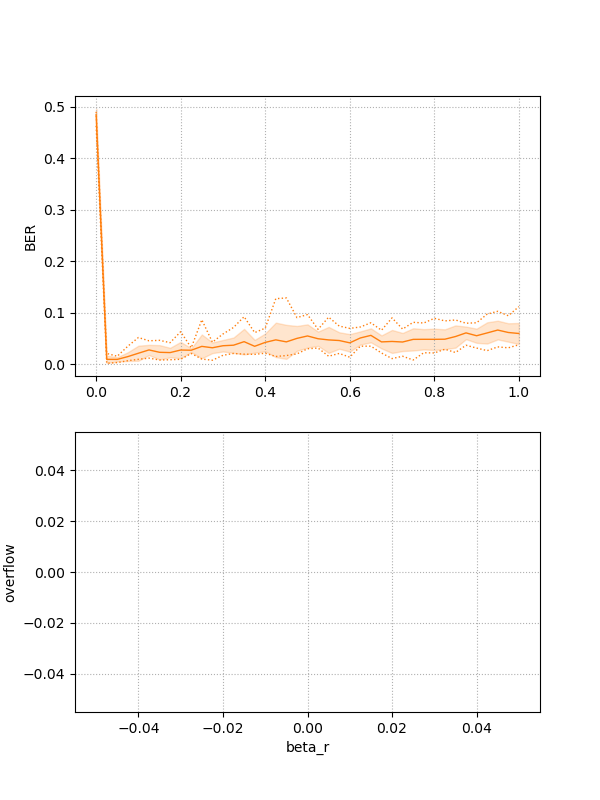

## data20221101_151150_main_xor
### Common config
```
hostname: anakin
dir_path: data/data20221101_151150_main_xor
Report  : data20221101_151150_main_xor.md
Test    : None
Exe     : python3 main_xor.py 
parallel: 128
```
### Default Config
```
 columns:None
     csv:None
      id:None
    plot:1
    show:False
 savefig:1
    fig1:fig1.png
 dataset:6
    seed:1
      NN:256
      MM:2200
     MM0:200
      Nu:1
      Nh:100
      Ny:1
    Temp:1
      dt:0.00390625
 alpha_i:0.93
 alpha_r:0.1
 alpha_b:0.0
 alpha_s:0.18
  alpha0:0
  alpha1:1
  beta_i:0.9
  beta_r:0.02
  beta_b:0.0
 lambda0:0.0
     BER:None
cnt_overflow:None
```
### Grid search 1D (alpha_r) 
1D grid search on alpha_r from 0.0 to 1.0 (41 points 10 samples)

Data:**data20221101_151150_main_xor_scan1d_alpha_r.csv**  
Start:20221101_151151  
Done :20221101_152111  
Figure:** data20221101_151150_main_xor_scan1d_alpha_r.png **  
  
### Grid search 1D (alpha_i) 
1D grid search on alpha_i from 0.0 to 1.0 (41 points 10 samples)

Data:**data20221101_151150_main_xor_scan1d_alpha_i.csv**  
Start:20221101_152112  
Done :20221101_153024  
Figure:** data20221101_151150_main_xor_scan1d_alpha_i.png **  
  
### Grid search 1D (alpha_s) 
1D grid search on alpha_s from 0.0 to 2.0 (41 points 10 samples)

Data:**data20221101_151150_main_xor_scan1d_alpha_s.csv**  
Start:20221101_153025  
Done :20221101_153940  
Figure:** data20221101_151150_main_xor_scan1d_alpha_s.png **  
  
### Grid search 1D (beta_i) 
1D grid search on beta_i from 0.0 to 1.0 (41 points 10 samples)

Data:**data20221101_151150_main_xor_scan1d_beta_i.csv**  
Start:20221101_153940  
Done :20221101_154855  
Figure:** data20221101_151150_main_xor_scan1d_beta_i.png **  
  
### Grid search 1D (beta_r) 
1D grid search on beta_r from 0.0 to 1.0 (41 points 10 samples)

Data:**data20221101_151150_main_xor_scan1d_beta_r.csv**  
Start:20221101_154856  
Done :20221101_155815  
Figure:** data20221101_151150_main_xor_scan1d_beta_r.png **  
  
